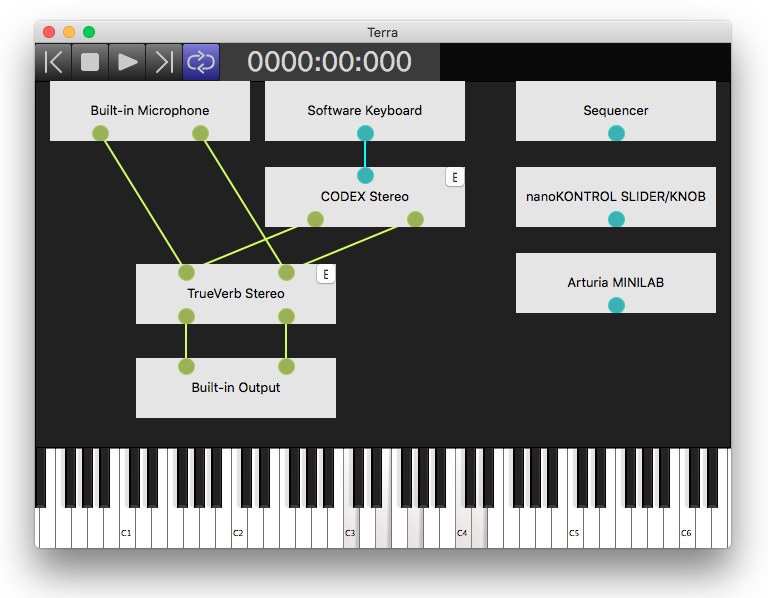

## What's this?

The yet another audio plugin hosting application. (alpha version)



## Features

* Load VST3 plugins.
* Open audio input/output devices.
* Open MIDI input devices.
* Connect plugins and devices.
    * To connect, drag from a pin of a plugin/device node to a pin of an another node.
    * To disconnect, cut connections by shift + drag.
* Send MIDI Notes with the computer keyboard.
    * A, W, S, ..., O, L, and P keys are mapped to C3, C#3, D3, ..., C#4, D4, and D#4.
    * Z and X keys change octaves.

## How to build

Currently Terra can be built on these platforms:

* macOS 10.14 & Xcode 10.2.1
* Windows 10 & Visual Studio 2019

### Prerequisites

* Java JRE (or JDK) version 8 or higher (for Gradle)
* Git 2.27.0 or later
* CMake 3.15 or later
* Xcode 11.3.1 or later
* Visual Studio 2019 or later
* autoconf, automake, libtool (macOS only)

### macOS

```sh
# Install prerequisites
brew install autoconf automake libtool

cd /path/to/develop

# Checkout the project
git clone https://github.com/hotwatermorning/Terra.git
cd Terra

# Generate a project file and build it.
# To build with release configuration, use `-Pconfig=Release`
cd ./gradle
./gradlew build_all [-Pconfig=Debug]

# To run the app, execute this command.
open ../build/<Debug or Release>/Terra.app

# To debug or modify source code, open the generated project file with this command.
open ../build/Terra.xcodeproj
```

### Windows

```bat
cd C:\path\to\develop

REM Checkout the project
git clone https://github.com/hotwatermorning/Terra.git
cd Terra

REM Generate a project file and build it.
REM To build with release configuration, use `-Pconfig=Release`
cd .\gradle
.\gradlew build_all [-Pconfig=Debug]

REM To run the app, execute this command.
open ..\build\<Debug or Release>\Terra.exe

REM To debug or modify source code, open the generated project file with this command.
open ..\build\Terra.sln
```

## License and dependencies.

Terra is licensed under MIT License.

Terra uses these libraries.

* [wxWidgets](http://www.wxwidgets.org/)
* [PortAudio](http://www.portaudio.com/)
* [VST3 SDK](https://github.com/steinbergmedia/vst3sdk)
* [cppformat](http://fmtlib.net)
* [RtMidi](https://github.com/thestk/rtmidi)
* [Protocol Buffers](https://developers.google.com/protocol-buffers/)
* [MPark.Variant](https://github.com/mpark/variant)
* [midifile](https://github.com/craigsapp/midifile)

## Contact

hotwatermorning@gmail.com

https://twitter.com/hotwatermorning
