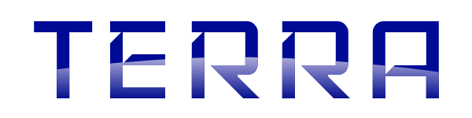

## What's this?

The yet another audio plugin hosting application. (alpha version)


## Features

* Load VST3 plugins.
* Open audio input/output devices.
* Open MIDI input devices.
* Connect plugins and devices.
    * To connect, drag from a pin of a plugin/device node to a pin of an another node.
    * To disconnect, cut connections by shift + drag.
* Send MIDI Notes with the computer keyboard.
    * A, W, S, ..., O, L, and P keys are mapped to C3, C#3, D3, ..., C#4, D4, and D#4.
    * Z and X keys change octaves.

## How to build

```sh
cd ./gradle
./gradlew build_all -Pconfig=Debug # or Release
open ../build_debug/Debug/Terra.app
```

Currently Terra can be built on macOS 10.13.4 & Xcode 9.3.1.

## License and dependencies.

Terra is licensed under MIT License.

Terra uses these libraries.

* [wxWidgets](http://www.wxwidgets.org/)
* [PortAudio](http://www.portaudio.com/)
* [VST3 SDK](https://github.com/steinbergmedia/vst3sdk)
* [cppformat](http://fmtlib.net)
* [RtMidi](https://github.com/thestk/rtmidi)
* [Protocol Buffers](https://developers.google.com/protocol-buffers/)
* [MPark.Variant](https://github.com/mpark/variant)
* [midifile](https://github.com/craigsapp/midifile)

## Contact

hotwatermorning@gmail.com

https://twitter.com/hotwatermorning
